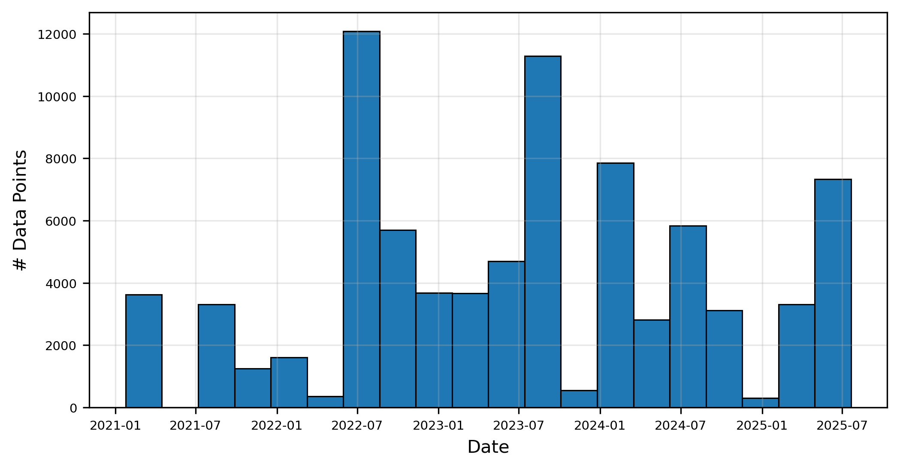
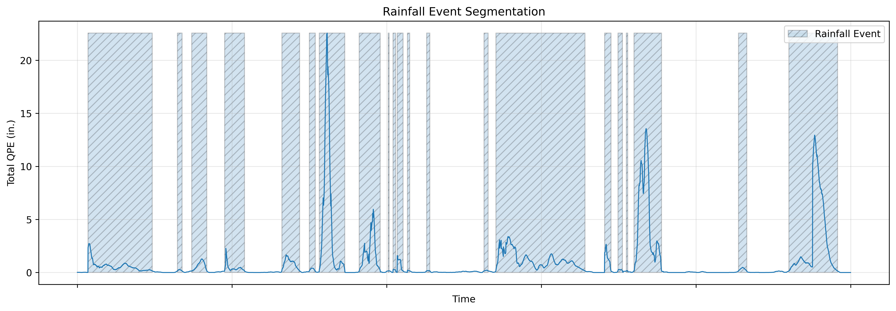

# **A study of CCRFCD rain-gauge & MRMS QPE alignment**
---
> *Work completed at the NWS in Las Vegas, NV*

This repository contains contains data and analysis of MRMS and Clark County Regional Flood Control District (CCRFCD) rain gauge QPE values for January of 2021 through July of 2025.

### Background & motivation

Las Vegas, NV is a low-lying, dry, and heavily populated region. Here, rain events are infrequent and especially dangerous, as even small amounts of precipitation reaching the ground can trigger flash-flooding events. Exasperating the challenge of forecasting in this region are disagrements between radar products and surface-level observations. High-based storms and low humidity have lead meterologists to believe that radar-only QPE products tend to *over estimate* surface-level precipitation. But just how well aligned are radar products and rain gauges, and what are the most important variables influincing "rain gauge bias" in the Las Vegas valley?

To systematically probe the questions above, we set out to conduct a large-scale study using precipitation data spanning the past five years (i.e., 2021-2025). By uncovering the key factors driving rain-guage bias, we hoped to develop simple, robust models that enable operational meteorologists to predict the offset between radar-only products and ground-level QPE for a wide range of events. By increasing confidence in various sources of guidance, we also hope to allow mets to issue accurate warnings sooner.

### Data collection & preparation

##### *CCRFCD rain-gauge values*

- Data source: [https://gustfront.ccrfcd.org/gagedatalist/](https://gustfront.ccrfcd.org/gagedatalist/)

We scraped data for 223 CCRFCD rain-gauges between the dates of [1/1/2020-7/26/25] using the script in `scripts/scrape_gustfront_v2.py` to crawl the Gustfront website. For each rain-gauge id in `data/7-23-25-scrape`, we select `interval=None` and `rawValues=False`. The resulting `csv` files have the following format:

| Date | Time | Value |
| :--: | :--: | :--:  |
| MM/DD/YYYY | HH:MM:SS | X.XX (in.) |
| "07/22/2025" | "16:00:56" | "1.34" |
| ... | ... | ... |

Here, the `Value` column represents *accumulated precipitation*, and resets to 0.0 at semi-random intervals. Also, note that `Date` and `Time` columns are recorded in Las Vegas **local time**.

##### *CCRFCD rain-gauge metadata*

We also gathered metadata about each CCRFCD weather station at `data/clark-county-rain-gauges/CCRFCD Station Locations 2025.csv`. 

| Station ID | Name | Type |   OOS   | Latitude | Longitude  |
| :--: | :--: | :--: | :--: | :--: | :--: |
| 2 | Willow Beach 2 (NPS) | NPS System | `FALSE` | 35.87789 | -114.58875 |
| ... | ... | ... | ... | ... | ... |

##### *MRMS 1H-QPE*

- Data source: AWS bucket @[s3://noaa-mrms-pds/CONUS](s3://noaa-mrms-pds/CONUS)

Fetching MRMS data for our region proved to be an interesting challenge. To make life easier, we built a small python API for the MRMS AWS bucket in `src.utils.mrmrs.mrms`.

```python
from src.utils.mrms.mrms import MRMSAWSS3Client, MRMSURLs


client   = MRMSAWSS3Client()
res      = client.ls(MRMSURLs.BASE_URL_CONUS)
print(res)
```

```python
> ['noaa-mrms-pds/CONUS/BREF_1HR_MAX_00.50', 'noaa-mrms-pds/CONUS/BrightBandTopHeight_00.00', ...]
```

Next, we developed a higher-level API in `src.mrms_qpe.fetch_mrms_qpe` to fetch products by date and handle `grib2` files behind the scenes.

```python
import xarray
from src.mrms_qpe.fetch_mrms_qpe import MRMSQPEClient


client               = MRMSQPEClient()
date                 = datetime.now()

# fetch MRMS 1H-QPE from [-1:00:now]; delete temporary files
xarr: xarray.Dataset = client.fetch_radar_only_qpe_full_day_1hr(date, del_tmps=True)
```

##### MRMS/CCRFCD data alignment

We bring everything together in the script at `scripts/gather_all_events.py`, which is responsible for generating a unified dataset of MRMS radar-only 1H-QPE and CCRFCD rain-gauge 1H-QPE data. Let's briefly walk through the steps to generate this dataset.

For each unique day (i.e., 00:00:00-23:59:59 UTC window) from [01/01/21] to [07/25/25], select days during which the following criteria are met.

1. MRMS data is available.
2. At least one grid-cell between lat/lon 35.8-36.4/-115.4-(-)114.8 records >= **0.25 inches** of precipitation in a 24 hour period.

Next, for all days that meet the above criteria, download all MRMS radar-only 1H-QPE `grib2` files. These files are spaced at two-minute intervals, yeilding a total of $30 * 24 = 720$ MRMS files/day. 

Now, for each rain-gauge we have data for, we run several algorithms to calculate the 1H-QPE of each CRFCD gauge, and align it to our MRMS 1H-QPE data. It may be easier to visualize what's going by looking a complete, aligned data-table for a 24H period.

| start_time | end_time | station_id | lat | lon | gauge_qpe | mrms_qpe |
| :--: | :--: | :--: | :--: | :--: | :--: | :--: |
| 2021-01-24 00:12:00 | 2021-01-24 01:12:00 |    2754    | 36.707972 | 245.923861 | 0.0 | 0.0 | 0.0 |
| ... | ... | ... | ... | ... | ... | ... |

Let's break down each of these columns:
- `start_time`: (**UTC**)
- `end_time`: (**UTC**)
- `station_id`: the CCRFCD rain-gauge's ID number
- `lat`/`lon`: location of the rain-gauge
- `gauge_qpe`: **(inches)** cummulative rainfall recorded by gauge between `start_time`/`end_time`
- `mrms_qpe`: **(inches)** cummulative rainfall recorded by MRMS radar-only product between `start_time`/`end_time` at `lat`/`lon`
    - Value for *the **nearest** MRMS grid-cell* to `lat`/`lon`

Note that we've taken extra care to convert the CCRFCD gauge timesteps from PDT->UTC. Also, we've deliberately **removed rows** in this table where `gauge_qpe` and `mrms_qpe` are 0.0. Full per-day `csv` files can be found in the `data/events` directory, which we will explore in greater detail down below.

##### Enviornmental data

- ASOS data source: [https://mesonet.agron.iastate.edu](https://mesonet.agron.iastate.edu)

We aimed to conduct a robust study of *which factors* contribute to rain-gauge bias. Therefore, it was necessary to gather some supplemental enviornmental data. For each day we gathered MRMS/CCRFCD data from, we also collect 0Z and 12Z soundings launched from VEF using the `sounderpy` package. Additionally, we collected ASOS station readings with the following parameters:

- `network`: NV_ASOS
- `station`:
    - 05U, 10U, 9BB, AWH, B23, BAM, BJN, BVU, CXP, DRA, EKO, ELY, HND, HTH, INS, LAS, LOL, LSV, MEV, NFL, P38, P68, RNO, RTS, TMT, TPH, U31, VGT, WMC
- `data`: all
- `tz`: Etc/UTC
- `format`: onlycomma
- `latlon`: yes
- `elev`: yes
- `missing`: M
- `trace`: T
- `direct`: no
- `report_type`: 3, 4

##### Raw data

We aggregated all the raw data we've collected so far into the `data/events` folder. This folder is formated like so:

```bash
YYYY-MM-DD HH:MM:SS
- YYYY-MM-DD HH:MM:SS_ASOS.csv
- YYYY-MM-DD HH:MM:SS_VEF_OZ_sounding.json
- YYYY-MM-DD HH:MM:SS_VEF_1Z_sounding.json
- ccrfcd_gauge_deltas_YYYY-MM-DD HH:MM:SS.csv
```

Where `ccrfcd_gauge_deltas_*.csv` files contain aligned MRMS/CCRFCD data.

### Methodology

> *You can follow along with the following sections in the `analysis.ipynb` notebook.*

In the first few cells we install necessary packages, import a few libraries, and declare a couple constants to use later on. Once we've loaded our dataset `.csv`  file into a `pandas.DataFrame`, we can take a look with the `df.head()` command.

| start_time | end_time | station_id | lat | lon | gauge_qpe | mrms_qpe | delta_qpe |
| :--: | :--: | :--: | :--: | :--: | :--: | :--: | :--: |
| 2021-01-23 23:00:00 | 2021-01-24 00:00:00 | 4709 | 35.925000 | 245.244.883000 | 0.0 | 0.003937 | -0.003937 |
| ... | ... | ... | ... | ... | ... | ... | ... |

The format of this dataframe is indetical to other shown above, with the addition of the `delta_qpe` column, computed simply as `gauge_qpe`$-$`mrms_qpe`. This huge dataset contains every day we've collected data for sorted in chronological order. Let's take at how much data we have.

```python
print(f"# Data points: {len(df)}")
print(f"# Unique gauges: {len(set(df['station_id']))}")
```

```bash
# Data points: 2337407
# Unique gauges: 223
```

Now let's plot a histogram to show the distribution of samples by time.



##### Synthetic rain 'event' construction

Recall that so far we've only collected a corpus of *days* (i.e., 24H) periods for which at least *some* rainfall occured. But, actual rainfall events can occur over multiple days, and may only last a few hours at a time. Therefore, we'll need to stich together our dataset into one, continous timeseries. Next, we'll segment this timeseries into individual rainfall "events" for further analysis. The bulk of this work is performed by the `segment_rainfall_events` function in our notebook. 

At a high-level, we classify a unique, rainfall event as a contigous block of time during which it is raining in the Las Vegas valley, and it hasn't stopped raining. 

Now, let's be a little more formal. Let $r_i \in \mathcal{R}$  be a rain gauge in the set of all unique gauges $\mathcal{R}$ where $i \in \{0, 1, ..., 223 - 1\}$, and $r_{i, t}$ be the value in inches recorded by a rain gauge at a timestep $t \in \{0, 1, ..., n - 1\}$ where $n$ is total number of unique timesteps in our dataset. Moreover, let $m_{i, t}$ be the corresponding *MRMS* 1H-QPE in inches at a rain gauge $r_i$ at timestep $t$. 

Furthermore, let $\epsilon = Q_{50}(\forall_{t}\sum_{i}m_{i, t}) \approx 0.145$ be the decision point we choose to toggle a rainfall "event"; the 50th percentile of the sum of MRMS 1H-QPE values at a timestep $t$. Next, for all timesteps $t$, we classify $t$ to be

$$ 
\left\{
\begin{array}{ll}
    raining & \frac{1}{15} \sum_{t-15:t} \sum_{i} m_{i, t} \ge \epsilon \\
    dry     & \frac{1}{15} \sum_{t-15:t} \sum_{i} m_{i, t} \lt \epsilon
\end{array}
\right.
$$

Now, we can easily assign arbitrary timesteps $t$ "event ids". Let's visualize a subset of our set, now segmented into synthetic rainfall "events". Here, the x-axis corresponds to timesteps $t$, and the y-axis is the sum of MRMS 1H-QPE for all rain-gauges, $\sum_{i} m_{i, t}$.



##### Training a random forest model

### Conclusions

### Acknowledgements

A huge thanks to the [**UNITES**](https://tianlong-chen.github.io/index.html#lab) group at UNC Chapel Hill for lending valuable computing resources to this project.
